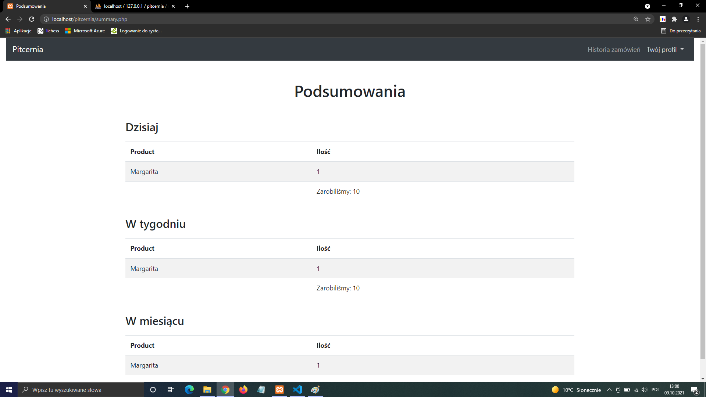
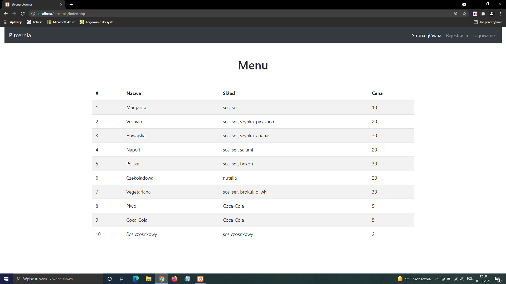
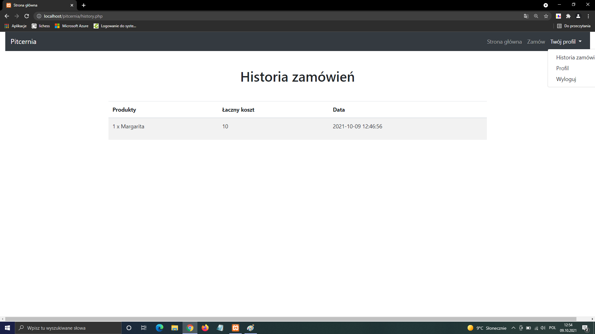
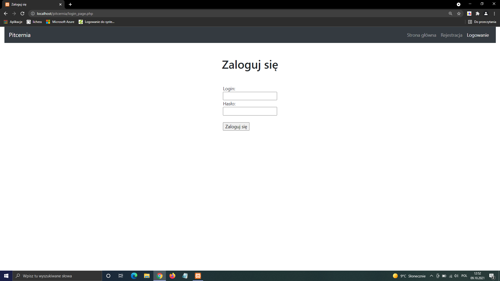
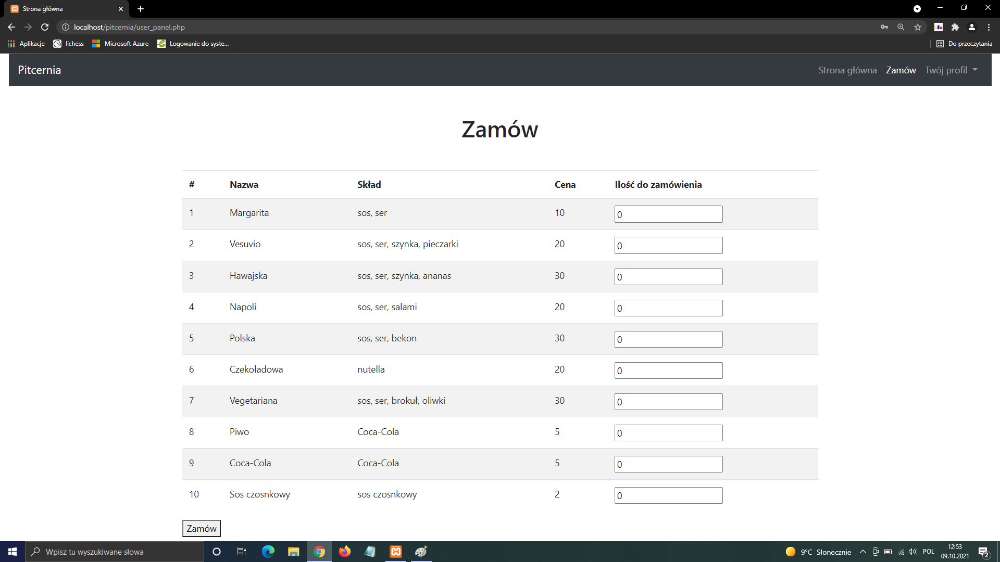
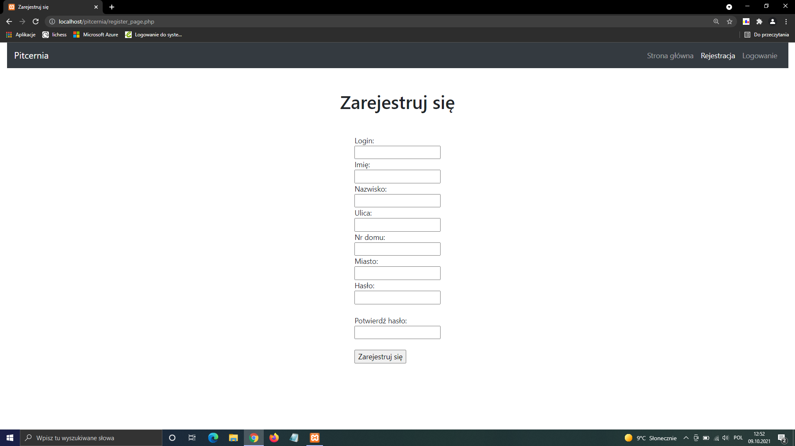

# pitcernia-high-school-project
PHP high school project. The website allows to manage orders in the pizzeria. After logging in the clients can make orders and view the order history. The employees can see the history of all  the orders as well as the financial reports.

